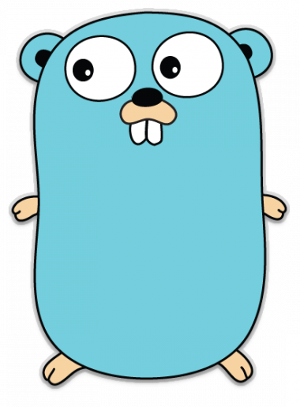

export { default as theme } from 'theme'
import Fullscreen from 'components/Fullscreen'

<Fullscreen />

## A Presentation on Golang



<br />
<small>
Edward Dobson
</small>
---
import Counter from 'components/Counter'

<Counter />
---
## Basic hello world program
```go
import "fmt"
func foo() {
    fmt.Println("Hello world")
}
```
---
The end